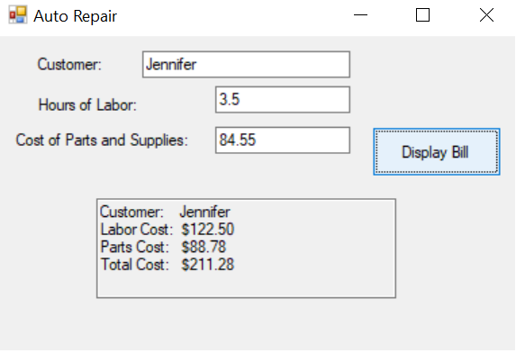

# Module1_Assignment2
Jennifer\
VB.net class project Module 1 assignment 2

# Analysis of the problem
1.	Write a program to display a simplified auto repair bill that includes the customer’s name, the number of hours of labor, and the cost of parts and supplies.  Auto repair customers are billed at $35 per hour and the tax on parts and supplies is 5%.  The customer name, the number of labor hours, and the cost of parts and supplies should be entered into text boxes.  
2.	The look and feel of the form are provided.  The text property value for the form, the three labels, and the button are provided.  The sales tax rate of 5% and hourly labor rate of $35 per hour are also provided.  
3.	When the “Display Bill” button is displayed then three lines should be output in a text-box showing the customer name, the labor cost, the supplies cost, and the total value of the bill.  Include ‘$’ signs and decimal points for dollar figures.

# Algorithm
1.	Create a form object with the text property set to “Auto Repair”
2.	Create three labels on the form with the text properties set accordingly to “Customer”, “Hours of Labor”, and “Cost of Parts and Supplies”
3.	Create blank text boxes next to each label for inputting values
4.	Create a button with the text property set to “Display Bill”
5.	Create a read-only text box at the bottom of the form for outputting the “invoice” values
6.	Set a constant value of 35 for the labor rate and a constant value of ‘0.05’ for the tax rate. 
7.	Create variables of type string for customerName, totalLabor, totalSupplies, totalBill
8.	Create variables of type double for labor, supplies, and total
9.	When the “Display Bill” button is clicked then convert the “Hours of Labor” and Cost of Parts and Supplies” into doubles and assign to the variables “labor” and “supplies” accordingly.  
10.	Assign the text of the “Customer” box to the variable “customerName”
11.	Multiply the “labor” by ‘35’ to obtain the cost of labor
l2.	Add the 5% tax rate to the “supplies” to obtain the total after-tax cost of supplies.  
13.	Add the values for “labor” and “supplies” and assign value to “total”
14.	Convert the data type of “labor” and “supplies” into strings and format to display as decimal numbers.  Assign these values as strings to “totalLabor” and “totalSupplies”
15.	Convert and format “total” as string and assign to “totalBill”
16.	Output the name of the customer (“customerName”), the labor cost (“totalLabor”), and the supplies cost (“totalSupplies”) to the read-only textbox with each output value on a separate line.  Use ‘$’ and decimal points for numerical values.  

# User Documentation
1.	Running the program
2.	Download the compressed folder (zip file) containing the visual basic project and executable.  The compressed folder will be named “Module_1_Assignment 2”.
3.	Extract the contents of the zip file.  This can be done in Windows 10 by right clicking the .zip file and selecting “Extract All”
4.	From the “Extract Compressed (Zipped) Folders” dialogue box click the button that says ‘extract’.
5.	Open the newly extracted zip file and navigate to  “.\Module1_Assignment2\bin\Release”
6.	From within the ‘Release’ folder, double click “Module1_Assignment2.exe” to run the program.

# Smart Screen Note
1.	In the event that smart screen prevents the program from running
2.	Right click the extracted executable
3.	Select properties
4.	Select the General tab from the properties menu
5.	Check unblock where the dialogue box says "Security:  The file came from another computer and might be blocked..."
6.	Once the program begins running, the user should see a form with three labels, three text boxes, a button that says “Display Bill”, and a read-only textbox.  The textboxes are the expected input fields for the user and the button is the expected means of action for displaying the invoice values.  The user is expected to put in a string for the customer name and numerical values for the labor hours and the cost of supplies.  When clicking the button, the expected output is that the read-only text box would be updated to display the customer name, the cost of labor, the cost of supplies, and the total value of the invoice.  The program can be terminated by clicking the ‘X’ in the top right hand corner of the form.

# Program Demo
